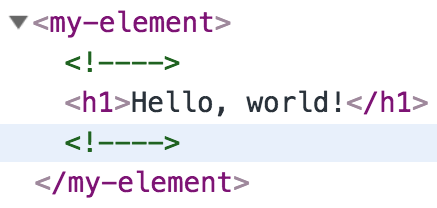

# Introduction
## What are Custom Elements?

[Custom Elements](https://html.spec.whatwg.org/dev/custom-elements.html) are a feature of modern browsers which allow you to extend their capabilities by installing new tags into their HTML markup vocabulary.

For example you could add your own custom button types, drop-down lists and other reusable components and use them just the same way as the built-in ones. You can add your own functionality and behavior to this custom elements, you can add new events to notify your application code of changes and you have powerful ways of styling them.

For example, say we wanted to create an element that formatted a person’s name

    <name-card first-name="John" last-name="Hardy"></name-card>

If the `name-card` tag was registered as a custom element component then the browser could be made to render it as

    <table>
      <tr>
        <th>First Name</th>
        <th>Last Name</th>
      </tr>
      <tr>
        <td>John</td>
        <td>Hardy</td>
      <tr>
    </table>

Custom Elements are useful for defining reusable components and widgets but they are expressive enough that they could even be used to control application logic and entire web pages. Because they are registered with the browser itself, Custom Elements do not compete with existing libraries and frameworks. In fact they can be used to facilitate greater interoperability and code sharing between them. 

A custom element designed for, say, an Angular application could easily be reused in a React application. The work that went into developing the component in one framework could be reused without modification in another. This enables a far greater flexibility in web development than we are used to. In fact Custom Elements helps defeat the general tendency of framework lock-in on the front-end web development.

You can think of Custom Elements as a sort of containerisation for web components. They have been designed to maximize flexibility and code reuse.

## Building Custom Elements

Let’s start with a simple example, an element that renders "Hello, world!" in the browser. A custom element looks pretty much like any other HTML element with one exception: all custom elements must have one or more hyphens in their name. 

No built-in elements can have hyphens so this is one way to tell them apart.

    <my-element></my-element>

Another thing to note is that all custom elements must have a closing tag. There are only a few self-closing tags permitted in HTML and none of them are custom elements.

To define the JavaScript of a custom element we use a class definition. Our simple element, which does nothing but render itself looks like this. 

    class MyElement extends HTMLElement { 
      
      constructor() { 
        super();        
        this.innerHTML = `<h1>Hello, world!</h1>`;
      }
    }

[See a working version here (use Chrome).](https://codepen.io/jhlagado/pen/QVPQWb?editors=1101)

The class definition must extend one of the built in classes of the browser which implements an HTML element. While it is possible to extend and inherit the behavior of any built-in element type, for example `HTMLButtonElement`, this is still currently a poorly supported feature of browsers. Therefore all of our examples will extend from the generic `HTMLElement`.

In this simple definition, we have a `constructor` and the first thing it must do is call its `super`. After this we can initialize DOM with new content. In our example we do this by simply updating the `innerHTML` of the element itself. 

While innerHTML is a simple and declarative way to update the DOM with HTML markup, this is not recommended beyond toy examples such as thing. `innerHTML` is very slow but it also introduces other problems which we can avoid with better solutions. Suffice it to say that using `innerHTML` is a quick and dirty solution for now which doesn't scale.

In order to register our custom element component with the browser and make it available to be used, we need to make a call to the `customElements.define`, passing the name of our new element and the class definition are arguments. 

    customElements.define('my-element', MyElement);

The resulting HTML in the browser looks like this.

While this is already pretty good, it has the downside of the custom element using innerHTML to overwrite its own body content. This is not always what we want to do because sometimes we might decide to use the body of the element as a way to pass in additional information to the custom element. What we really want is a way to separate what we put into the body of the custom element from how we display it. 

We can achieve this by using another feature of the modern browser platform called the [Shadow DOM](https://developer.mozilla.org/en-US/docs/Web/Web_Components/Using_shadow_DOM).

